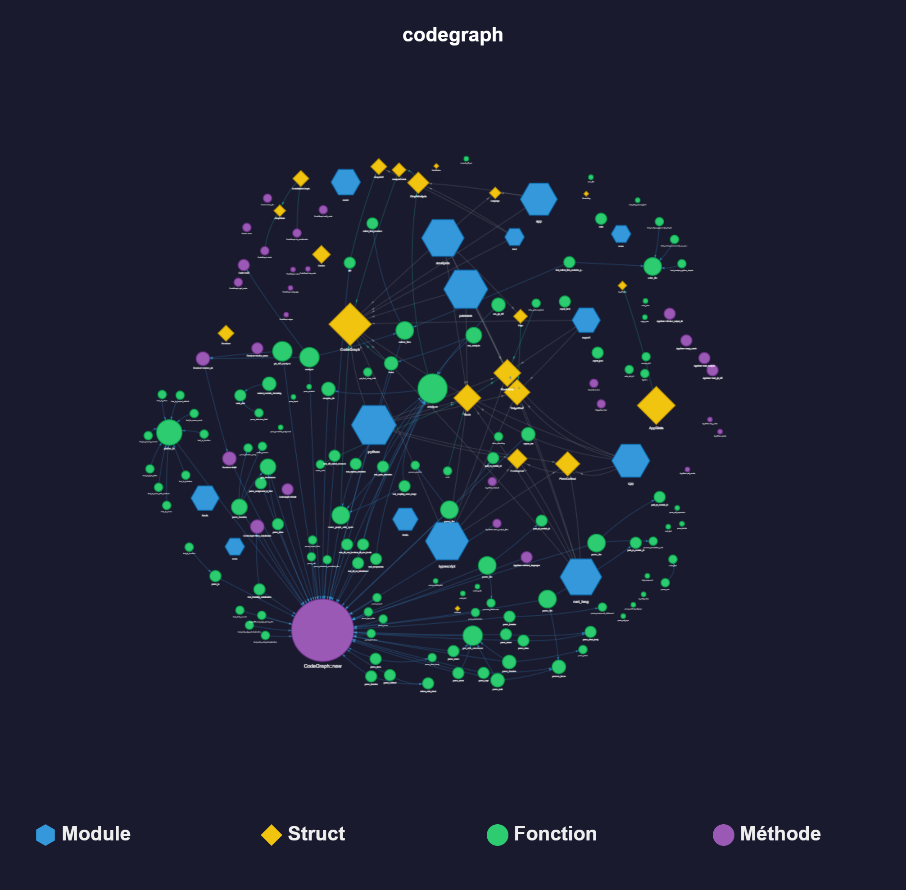
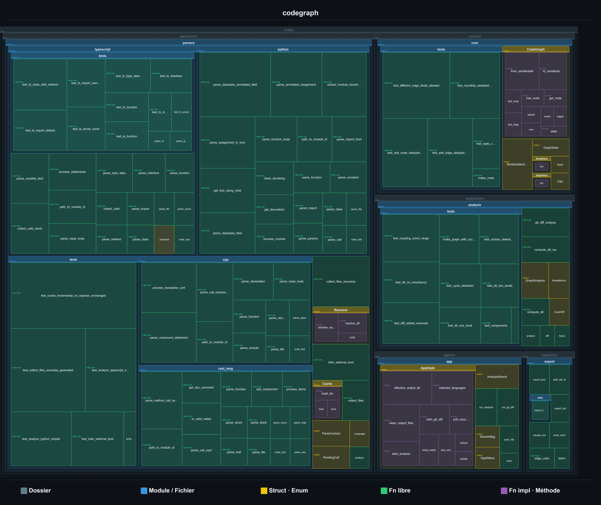

# codegraph

> Multi-language static analyzer that builds and visualizes dependency graphs across Python, Rust, C++, TypeScript and JavaScript codebases.

<p align="center" style="display:flex;justify-content:space-between;">
  
  &nbsp;
  
</p>

---

## What it does

**codegraph** parses your source tree, resolves cross-file and cross-language dependencies, and produces a single self-contained HTML file with an interactive visualization of everything:

- **Nodes** — modules, classes, structs, functions, methods, constants
- **Edges** — calls, imports, inheritance, type usage, containment

---

## Features

### Languages
- **Python**, **Rust**, **C++**, **TypeScript**, **JavaScript**
- Resolves imports, aliases, method calls and type annotations across files

### Graph view
- Interactive HTML visualization powered by [vis.js](https://visjs.org/)
- Force-directed, hierarchical, cluster and component layout modes
- Node size proportional to connection count
- File-tree navigation panel to drill into sub-folders
- Filter by node kind, coupling score or external dependencies
- Right-click to hide a node and all its edges
- Settings panel (node size, repulsion, link attraction, simulation speed)

### Structural view
- Nested-box treemap showing the physical containment hierarchy: **folder → file → class/struct → function/method**
- Virtual folder nodes synthesized automatically from file paths (single-child chains collapsed)
- Layout uses a **squarified treemap** (Bruls–Huizing–van Wijk) — cells are as square as possible and sized proportionally to the name length so labels are always readable
- Distinct color per node kind (7 hues spread across the color wheel)
- Scroll to zoom · drag to pan · **Reset zoom** button re-centers the view
- "Show external dependencies" filter applies to both views simultaneously
- Cell size adjustable via the settings slider

### Export
- **PNG** export of the currently active layout (graph or structural view)
  - Graph PNG: 2× resolution with title and legend
  - Structural PNG: 3× resolution (vector source — lossless at any scale) with title and legend
- **SVG** export of both views

### GUI app
- Native desktop GUI built with [egui](https://github.com/emilk/egui)
- Select the **project folder** to analyze and the **output folder** where `graph.html` and `graph.json` are written (defaults to the project folder)
- **Clean** button removes all generated files (`graph.html`, `graph.json`, `diff.html`) from the output folder
- Language checkboxes, cache toggle, watch mode (auto-reload on file change), focus node + depth
- Incremental cache — unchanged files are skipped on re-run

### Diff mode
- Compares the current state against any git ref
- Generated `diff.html` highlights added / removed nodes and edges

---

## Installation

Requires [Rust](https://rustup.rs/) (stable).

```bash
git clone https://github.com/you/codegraph
cd codegraph
cargo build --release
```

Then run the GUI:

```bash
cargo run --release -p app
```

---

## Architecture

```
crates/
├── core/       — graph data model (nodes, edges, serialization)
├── parsers/    — language parsers + dependency resolver
│   ├── rust_lang.rs
│   ├── python.rs
│   ├── cpp.rs
│   ├── typescript.rs
│   └── javascript.rs
├── analysis/   — graph metrics, cycle detection, orphan detection, git diff
├── export/     — self-contained HTML export (vis.js graph + structural treemap)
└── app/        — native GUI (egui + rfd file dialogs)
```

---

## License

MIT
